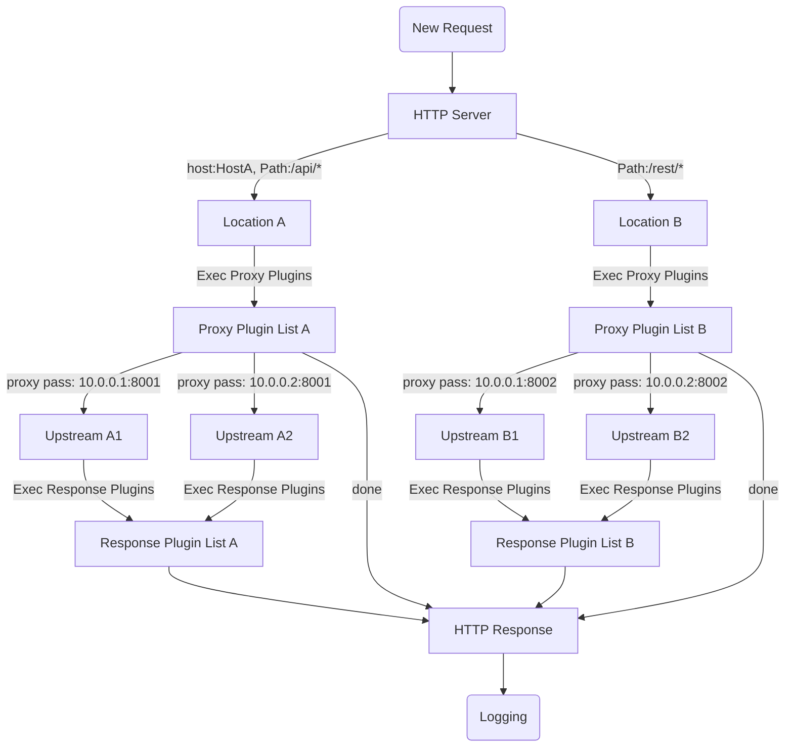

# louailink

## What is LouAILink

A reverse proxy like nginx, built on [pingora](https://github.com/cloudflare/pingora), simple and efficient.

> LouAILink：这里"Lou"可以是"low"（低延迟）的谐音，"AI"代表人工智能，"Link"表示连接。整个名称强调了低延迟的AI连接网关

## Feature

- Filter location by host and path
- Path rewrite with regexp
- HTTP 1/2 end to end proxy
- multi base configuration, file or etcd storage
- Graceful reload and auto restart after the configuration is changed
- Template for http access log
- Admin Web UI configuration
- Generate TLS certificates from let's encrypt
- Notification events: `lets_encrypt`, `backend_unhealthy`, `diff_config`, `restart`, etc.
- Http proxy plugins: `compression`, `static serve`, `limit`, `stats`, `mock`, etc.

## Start

Loads all configurations from `$HOME/.louailink` and run in the background. Log appends to `$HOME/.louailink/louailink.log`.

```bash
RUST_LOG=INFO louailink -c=$HOME/.louailink -d --log=$HOME/.louailink/louailink.log
```

## Graceful restart

Validate the configurations, send quit signal to louailink, then start a new process to handle all requests.

```bash
RUST_LOG=INFO louailink -c=$HOME/.louailink -t \
  && pkill -SIGQUIT louailink \
  && RUST_LOG=INFO louailink -c=$HOME/.louailink -d -u --log=$HOME/.louailink/louailink.log
```

## Auto restart

Watch the configurations, if one of them changes, graceful restart louailink.

```bash
RUST_LOG=INFO louailink -c=$HOME/.louailink \
  && -a -d --log=$HOME/.louailink/louailink.log
```

## Dev

```bash
# generate admin web asset
make build-web
make dev
```


## Config

All toml configurations are as follows [louailink.toml](./conf/louailink.toml).
All yaml configurations are as follows [louailink.yaml](./conf/louailink.yaml).

## Proxy step



